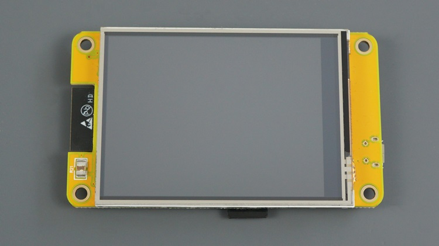
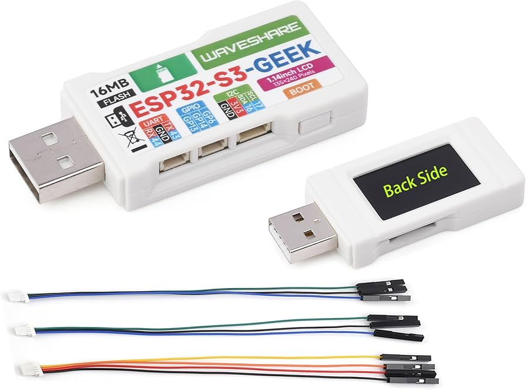

# Hoofdstuk 1: Inleiding

## 1.1 Overzicht van het Project
ESP32-Crypto-Alert is een standalone apparaat gebaseerd op de ESP32-microcontroller, ontworpen om cryptocurrency-prijzen in realtime te monitoren en contextuele alerts te genereren. Het haalt live prijsdata op van Binance en analyseert prijsbewegingen over meerdere timeframes (1 minuut, 5 minuten, 30 minuten en 2 uur). In plaats van constante notificaties, richt het zich op relevante veranderingen zoals spikes, momentum-shifts of structurele breaks.

Het apparaat werkt volledig lokaal, zonder afhankelijkheid van externe servers of cloud-diensten. Alerts worden weergegeven op een ingebouwd scherm, verstuurd via NTFY.sh, toegankelijk via een web-interface en optioneel doorgestuurd via MQTT naar Home Assistant.

  
*ESP32-2432S028R "Cheap Yellow Display" – een populaire keuze voor dit project.*

  
*LilyGO TTGO T-Display – compact board met 1.14" scherm.*

  
*LilyGO T-Display S3 – modernere variant met ESP32-S3.*

  
*Waveshare ESP32-S3-GEEK – krachtige S3 met 1.14" IPS-display.*

## 1.2 Doelgroep en Gebruiksscenario's
Deze tool is bedoeld voor:
- Individuele crypto-traders die prijsveranderingen willen volgen zonder constant apps te checken.
- Gebruikers van smarthome-systemen (bijv. Home Assistant).
- Hobbyisten geïnteresseerd in IoT en cryptocurrency.

Voorbeelden:
- Plaats het apparaat op je bureau voor visuele updates.
- Integreer met NTFY voor mobiele notificaties.
- Koppel aan Home Assistant voor automations.

## 1.3 Unieke Features
- **Anchor Price Concept**: Door jou gedefinieerde referentieprijs om winst/verlies te contextualiseren.
- **Multi-Timeframe Analyse**: Korte- en langetermijnbewegingen combineren om ruis te filteren.
- **Aanpasbare Sensitivity**: Presets (Conservative, Balanced, Aggressive) en custom thresholds.
- **Volledig Lokale Configuratie**: Via web-UI, geen hercompilatie nodig.
- **Brede Hardware-ondersteuning**: Verschillende ESP32-boards met TFT-displays.

## 1.4 Waarschuwingen en Disclaimer
- Dit project biedt **geen financieel advies**.
- Cryptocurrency-markten zijn volatiel; gebruik op eigen risico.
- Zorg voor een stabiele WiFi-verbinding (data komt van Binance API).

## 1.5 Volgende Stappen
In de volgende hoofdstukken gaan we dieper in op de functies, hardware, installatie en configuratie.

---

*Ga naar [Hoofdstuk 2: Functies en Mogelijkheden](02-Functies.md)*