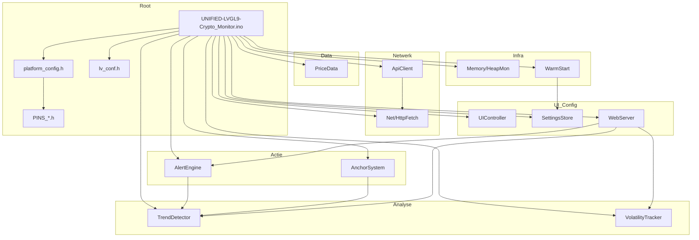

# 01 – Architectuur

## Componentoverzicht

De applicatie is opgebouwd uit een hoofdsketch (.ino) die globals en taken beheert, en uit modules in `src/` voor netwerk, API, data, trend, volatiliteit, anchor, alerts, UI, instellingen, geheugen, warm-start en webserver. Onderstaand diagram geeft de relaties tussen de belangrijkste componenten.

## Modules: inputs, outputs, state en failure modes

### Net (HttpFetch)

| Aspect | Beschrijving |
|--------|--------------|
| **Input** | URL, buffer-pointer, buffergrootte, timeout (ms). |
| **Output** | `true`/`false`; bij succes: body in `buf`, lengte in `outLen`. |
| **State** | Geen interne state; gebruikt `gNetMutex` (extern). |
| **Belangrijk** | `httpGetToBuffer()` – streaming read naar buffer, geen `String`-allocatie. |
| **Failure** | Timeout, connect/read fout, buffer te klein; mutex timeout als netwerk door andere taak wordt gebruikt. |

### ApiClient

| Aspect | Beschrijving |
|--------|--------------|
| **Input** | URL of symbol (bijv. `BTC-EUR`); globale `gApiResp`, `gNetMutex`. |
| **Output** | `httpGET()`, `fetchBitvavoPrice(symbol, out)` → prijs in `out`; `parseBitvavoPrice()` static. |
| **State** | Persistente `WiFiClient` en `HTTPClient` (keep-alive). |
| **Belangrijk** | `fetchBitvavoPrice`, `parseBitvavoPriceFromStream`, `logHttpError`, `isValidPrice`, `safeAtof`. |
| **Failure** | Geen WiFi, HTTP ≠ 200, timeout, ongeldige JSON/prijs; backoff/retry in .ino. |

### PriceData

| Aspect | Beschrijving |
|--------|--------------|
| **Input** | Nieuwe prijs via `addPriceToSecondArray(price)`; arrays/indexen (seconden, 5m, minuten) globaal in .ino. |
| **Output** | Getters voor arrays en indexen; `calculateReturn1Minute()`; sync van indexen naar globals. |
| **State** | `secondIndex`, `secondArrayFilled`, `fiveMinuteIndex`, `fiveMinuteArrayFilled`; minute state in .ino. |
| **Belangrijk** | `addPriceToSecondArray` (vult seconden + 5m), `getSecondPrices()`, `getFiveMinutePrices()`, `getMinuteAverages()`, `calculateReturn1Minute()`, `syncStateFromGlobals()`. |
| **Failure** | Ongeldige prijs (NaN/≤0) wordt genegeerd; null `fiveMinutePrices`/`minuteAverages` → skip 5m/minuut-update. |

### TrendDetector

| Aspect | Beschrijving |
|--------|--------------|
| **Input** | `ret_2h`, `ret_30m`, `ret_1d`, `ret_7d`, `trendThreshold`; globals voor sync. |
| **Output** | `TrendState` (UP/DOWN/SIDEWAYS) voor 2h, medium (1d), long-term (7d); trend change notificatie (met cooldown). |
| **State** | `trendState`, `previousTrendState`, medium/long-term variants, `lastTrendChangeNotification` (en 1d/7d). |
| **Belangrijk** | `determineTrendState()`, `determineMediumTrendState()`, `determineLongTermTrendState()`, `checkTrendChange()`, `checkMediumTrendChange()`, `checkLongTermTrendChange()`, `syncStateFromGlobals()`. |
| **Failure** | Alleen afhankelijk van geldige returns; bij onvoldoende data blijft vorige state staan. |

### VolatilityTracker

| Aspect | Beschrijving |
|--------|--------------|
| **Input** | Abs 1m return (`addAbs1mReturnToVolatilityBuffer`), 1m return voor sliding window (`updateVolatilityWindow`); thresholds uit settings. |
| **Output** | `VolatilityState` (LOW/MEDIUM/HIGH), `calculateAverageAbs1mReturn()`, `calculateEffectiveThresholds()` voor auto-vol. |
| **State** | `volatilityState`, `volatilityIndex`/`volatilityArrayFilled`, `volatility1mIndex`/`volatility1mArrayFilled`; globale arrays in .ino. |
| **Belangrijk** | `addAbs1mReturnToVolatilityBuffer`, `calculateAverageAbs1mReturn`, `determineVolatilityState`, `updateVolatilityWindow`, `calculateEffectiveThresholds`, `syncStateFromGlobals()`. |
| **Failure** | Lege of onvoldoende gevulde buffer → default MEDIUM; array null → skip update. |

### AnchorSystem

| Aspect | Beschrijving |
|--------|--------------|
| **Input** | `setAnchorPrice(value, shouldUpdateUI, skipNotifications)`; huidige prijs voor `updateAnchorMinMax(currentPrice)`. |
| **Output** | Beslissing + payload (titel, bericht, colorTag); roept extern `sendNotification()` aan. Daadwerkelijke NTFY-verzending en MQTT anchor-events zitten in .ino (`sendNotification()` → `sendNtfyNotification()`; `publishMqttAnchorEvent()`). UI-updates; effectieve thresholds via `calculateEffectiveAnchorThresholds`. |
| **State** | Anchorprijs, anchorMin/Max, anchorTime, anchorActive, takeProfitSent/maxLossSent; trend-adaptive settings. |
| **Belangrijk** | `setAnchorPrice`, `checkAnchorAlerts`, `updateAnchorMinMax`, `calculateEffectiveAnchorThresholds`, `syncStateFromGlobals()`. |
| **Failure** | Ongeldige prijs of mutex timeout → setAnchor faalt; transportfouten (NTFY/MQTT) in .ino, geen crash. |

### AlertEngine

| Aspect | Beschrijving |
|--------|--------------|
| **Input** | `ret_1m`, `ret_5m`, `ret_30m`; globale thresholds, cooldowns, 2h-metrics, volume/range status. |
| **Output** | Beslissing of er een alert moet; bouwt payload (title, message, colorTag) en roept extern `sendNotification()` aan. Daadwerkelijke verzending (NTFY HTTPS) gebeurt in .ino (`sendNotification()` → `sendNtfyNotification()`). Geen aparte notifier-module in src/. |
| **State** | `lastNotification1Min/30Min/5Min`, `alerts*ThisHour`, `hourStartTime`; `last1mEvent`, `last5mEvent`, `lastConfluenceAlert`; 2h throttling state. |
| **Belangrijk** | `checkAndNotify()`, `checkAlertConditions()`, `sendAlertNotification()`, `update1mEvent`/`update5mEvent`, `checkAndSendConfluenceAlert()`, `check2HNotifications()`, `send2HNotification()` + throttling. |
| **Failure** | NaN/Inf returns → skip; cooldown/hourly limit → geen aanroep send; transportfout in .ino → alleen logging. |

### UIController

| Aspect | Beschrijving |
|--------|--------------|
| **Input** | Globale prijzen, returns, trend, volatiliteit, anchor, warm-start status; LVGL callbacks (flush, millis, print). |
| **Output** | LVGL-objecten (chart, labels, kaarten), `updateUI()` – alle zichtbare updates. |
| **State** | Pointers naar LVGL-widgets (chart, dataSeries, priceBox, labels, …); caches voor laatste waarden om flikkeren te verminderen. |
| **Belangrijk** | `setupLVGL()`, `buildUI()`, `updateUI()`, `updateChartSection`, `updatePriceCardsSection`, `update*Label()`, `checkButton()`. |
| **Failure** | Null-pointer of niet-geïnitialiseerd display → veilige checks; mutex timeout in uiTask → update wordt overgeslagen. |

### SettingsStore

| Aspect | Beschrijving |
|--------|--------------|
| **Input** | `CryptoMonitorSettings` bij save; NVS namespace + keys. |
| **Output** | `load()` → gevulde `CryptoMonitorSettings`; `save(settings)`; `generateDefaultNtfyTopic()`. |
| **State** | `Preferences` (NVS); geen runtime state behalve tijdens load/save. |
| **Belangrijk** | `load()`, `save()`, `generateDefaultNtfyTopic()`; alle PREF_KEY_* en struct-velden. |
| **Failure** | NVS vol of corrupt → defaults; topic-migratie bij oude key. |

### Memory (HeapMon)

| Aspect | Beschrijving |
|--------|--------------|
| **Input** | Geen parameters voor `snapHeap()`; tag voor `logHeap(tag)`. |
| **Output** | `HeapSnap` (freeHeap, largestBlock, minFreeHeap); rate-limited Serial-log. |
| **State** | Rate limit per tag (geen log vaker dan 1x per 5s per tag). |
| **Belangrijk** | `snapHeap()`, `logHeap(tag)`, `resetRateLimit(tag)`. |
| **Failure** | Geen; alleen observatie. |

### WarmStart (WarmStartWrapper)

| Aspect | Beschrijving |
|--------|--------------|
| **Input** | Settings-pointer, logger (Stream); `beginRun()`, `endRun(mode, stats, status, …)`. |
| **Output** | Stats (loaded 1m/5m/30m/2h), status (WARMING_UP/LIVE/LIVE_COLD), logging. |
| **State** | `m_stats`, `m_status`, `m_startTimeMs`; echte warm-start (candles fetchen, buffers vullen) in .ino. |
| **Belangrijk** | `beginRun()`, `endRun()`, `stats()`, `status()`, settings-getters. |
| **Failure** | API/timeout bij candles → partial/failed mode; wrapper zelf faalt niet. |

### WebServer (WebServerModule)

| Aspect | Beschrijving |
|--------|--------------|
| **Input** | HTTP-requests; `server` (extern), globals voor status/instellingen. |
| **Output** | HTML-instellingenpagina, redirect na save, status-JSON, OTA upload-endpoints. |
| **State** | Optionele page-cache (`sPageCache`, `sPageCacheValid`) voor performance. |
| **Belangrijk** | `setupWebServer()`, `handleRoot`, `handleSave`, `handleAnchorSet`, `handleStatus`, `handleUpdate*`, `renderSettingsHTML()`. |
| **Failure** | WiFi weg → geen handle; parsefouten bij save → foutmelding; geen secrets in responses. |

---

## State map

| Categorie | Voorbeelden (uit repo) |
|-----------|------------------------|
| **Volatile runtime (RAM)** | `prices[]`, `openPrices[]`, ringbuffers (`secondPrices`, `fiveMinutePrices`, `minuteAverages`, `hourlyAverages`), indexen (`secondIndex`, `fiveMinuteIndex`, `minuteIndex`, `hourIndex`), `anchorPrice`/`anchorMax`/`anchorMin`, `trendState`, `volatilityState`, cooldown-timestamps (`lastNotification1Min`, `lastNotification5Min`, `lastNotification30Min`, `lastConfluenceAlert`, 2h-throttling state), `last1mEvent`/`last5mEvent`, connectivity (`mqttConnected`, `wsConnected`). |
| **Persistent (NVS/Preferences)** | `CryptoMonitorSettings` via SettingsStore: ntfyTopic, bitvavoSymbol, alert thresholds, notification cooldowns, 2h-thresholds, anchor settings, warm-start settings, MQTT credentials, language, displayRotation, night mode, auto-volatility, enz. |
| **Derived (afgeleide signalen)** | `ret_1m`, `ret_5m`, `ret_30m`, `ret_2h`, `ret_1d`, `ret_7d` (uit buffers berekend), `trendState`/`mediumTrendState`/`longTermTrendState` (TrendDetector), `volatilityState` en `EffectiveThresholds` (VolatilityTracker), `hasRet2h`/`hasRet30mLive` e.d., warm-start status. |

---

## Root-bestanden

- **UNIFIED-LVGL9-Crypto_Monitor.ino**: Globals (prijzen, buffers, anchor, trend, volatiliteit, alert state, UI-pointers, mutexen), `setup()` (serial, display, LVGL, mutex, arrays, WiFi, warm-start, buildUI, tasks), `loop()` (OTA, MQTT, deferred actions), `apiTask`, `uiTask`, `webTask`, `priceRepeatTask`, `fetchPrice()`, warm-start, WiFi/MQTT/NTFY.
- **platform_config.h**: Eén actieve `PLATFORM_*` define; per platform o.a. SYMBOL_COUNT, CHART_*, FONT_*, MQTT_TOPIC_PREFIX, BUTTON_PIN, OTA_ENABLED; versie, DEBUG_*, DEFAULT_LANGUAGE.
- **lv_conf.h**: LVGL 9 (kleur, heap, OS, rendering, fonts, etc.); geen applicatielogica.
- **PINS_*.h**: Per board: SPI/I2C-bus, display-driver, pinnen, `gfx`, `bus`, `DEV_DEVICE_INIT()`; alleen geïncludeerd als geen `UICONTROLLER_INCLUDE`/`MODULE_INCLUDE`.

Deze architectuur zorgt voor duidelijke scheiding: data en tijdreeksen in PriceData + .ino, signaaldetectie in Trend/Volatility/AlertEngine, acties in AnchorSystem en AlertEngine, weergave in UIController, configuratie in SettingsStore en WebServer, en infrastructuur in Net, ApiClient, Memory en WarmStart.

---
**[← 00 Overzicht](00_OVERVIEW.md)** | [Overzicht technische docs](../README_NL.md#technische-documentatie-code-werking) | **[02 Dataflow →](02_DATAFLOW.md)**
