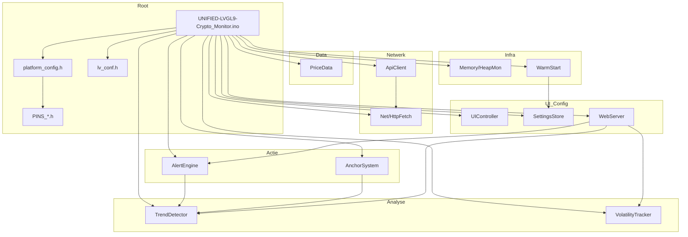

# 01 – Architecture

## Component overview

The application consists of a main sketch (.ino) that manages globals and tasks, and modules in `src/` for network, API, data, trend, volatility, anchor, alerts, UI, settings, memory, warm-start and web server. The diagram below shows the relationships between the main components.

## Modules: inputs, outputs, state and failure modes

### Net (HttpFetch)

| Aspect | Description |
|--------|-------------|
| **Input** | URL, buffer pointer, buffer size, timeout (ms). |
| **Output** | `true`/`false`; on success: body in `buf`, length in `outLen`. |
| **State** | No internal state; uses `gNetMutex` (external). |
| **Important** | `httpGetToBuffer()` – streaming read to buffer, no `String` allocation. |
| **Failure** | Timeout, connect/read error, buffer too small; mutex timeout if network in use by another task. |

### ApiClient

| Aspect | Description |
|--------|-------------|
| **Input** | URL or symbol (e.g. `BTC-EUR`); global `gApiResp`, `gNetMutex`. |
| **Output** | `httpGET()`, `fetchBitvavoPrice(symbol, out)` → price in `out`; `parseBitvavoPrice()` static. |
| **State** | Persistent `WiFiClient` and `HTTPClient` (keep-alive). |
| **Important** | `fetchBitvavoPrice`, `parseBitvavoPriceFromStream`, `logHttpError`, `isValidPrice`, `safeAtof`. |
| **Failure** | No WiFi, HTTP ≠ 200, timeout, invalid JSON/price; backoff/retry in .ino. |

### PriceData

| Aspect | Description |
|--------|-------------|
| **Input** | New price via `addPriceToSecondArray(price)`; arrays/indices (seconds, 5m, minutes) global in .ino. |
| **Output** | Getters for arrays and indices; `calculateReturn1Minute()`; sync of indices to globals. |
| **State** | `secondIndex`, `secondArrayFilled`, `fiveMinuteIndex`, `fiveMinuteArrayFilled`; minute state in .ino. |
| **Important** | `addPriceToSecondArray` (fills seconds + 5m), `getSecondPrices()`, `getFiveMinutePrices()`, `getMinuteAverages()`, `calculateReturn1Minute()`, `syncStateFromGlobals()`. |
| **Failure** | Invalid price (NaN/≤0) ignored; null `fiveMinutePrices`/`minuteAverages` → skip 5m/minute update. |

### TrendDetector

| Aspect | Description |
|--------|-------------|
| **Input** | `ret_2h`, `ret_30m`, `ret_1d`, `ret_7d`, `trendThreshold`; globals for sync. |
| **Output** | `TrendState` (UP/DOWN/SIDEWAYS) for 2h, medium (1d), long-term (7d); trend change notification (with cooldown). |
| **State** | `trendState`, `previousTrendState`, medium/long-term variants, `lastTrendChangeNotification` (and 1d/7d). |
| **Important** | `determineTrendState()`, `determineMediumTrendState()`, `determineLongTermTrendState()`, `checkTrendChange()`, `checkMediumTrendChange()`, `checkLongTermTrendChange()`, `syncStateFromGlobals()`. |
| **Failure** | Only depends on valid returns; with insufficient data previous state is kept. |

### VolatilityTracker

| Aspect | Description |
|--------|-------------|
| **Input** | Abs 1m return (`addAbs1mReturnToVolatilityBuffer`), 1m return for sliding window (`updateVolatilityWindow`); thresholds from settings. |
| **Output** | `VolatilityState` (LOW/MEDIUM/HIGH), `calculateAverageAbs1mReturn()`, `calculateEffectiveThresholds()` for auto-vol. |
| **State** | `volatilityState`, `volatilityIndex`/`volatilityArrayFilled`, `volatility1mIndex`/`volatility1mArrayFilled`; global arrays in .ino. |
| **Important** | `addAbs1mReturnToVolatilityBuffer`, `calculateAverageAbs1mReturn`, `determineVolatilityState`, `updateVolatilityWindow`, `calculateEffectiveThresholds`, `syncStateFromGlobals()`. |
| **Failure** | Empty or insufficient buffer → default MEDIUM; array null → skip update. |

### AnchorSystem

| Aspect | Description |
|--------|-------------|
| **Input** | `setAnchorPrice(value, shouldUpdateUI, skipNotifications)`; current price for `updateAnchorMinMax(currentPrice)`. |
| **Output** | Decision + payload (title, message, colorTag); calls external `sendNotification()`. Actual NTFY delivery and MQTT anchor events are in .ino (`sendNotification()` → `sendNtfyNotification()`; `publishMqttAnchorEvent()`). UI updates; effective thresholds via `calculateEffectiveAnchorThresholds`. |
| **State** | Anchor price, anchorMin/Max, anchorTime, anchorActive, takeProfitSent/maxLossSent; trend-adaptive settings. |
| **Important** | `setAnchorPrice`, `checkAnchorAlerts`, `updateAnchorMinMax`, `calculateEffectiveAnchorThresholds`, `syncStateFromGlobals()`. |
| **Failure** | Invalid price or mutex timeout → setAnchor fails; transport errors (NTFY/MQTT) in .ino, no crash. |

### AlertEngine

| Aspect | Description |
|--------|-------------|
| **Input** | `ret_1m`, `ret_5m`, `ret_30m`; global thresholds, cooldowns, 2h metrics, volume/range status. |
| **Output** | Decision whether to alert; builds payload (title, message, colorTag) and calls external `sendNotification()`. Actual delivery (NTFY HTTPS) is in .ino (`sendNotification()` → `sendNtfyNotification()`). No separate notifier module in src/. |
| **State** | `lastNotification1Min/30Min/5Min`, `alerts*ThisHour`, `hourStartTime`; `last1mEvent`, `last5mEvent`, `lastConfluenceAlert`; 2h throttling state. |
| **Important** | `checkAndNotify()`, `checkAlertConditions()`, `sendAlertNotification()`, `update1mEvent`/`update5mEvent`, `checkAndSendConfluenceAlert()`, `check2HNotifications()`, `send2HNotification()` + throttling. |
| **Failure** | NaN/Inf returns → skip; cooldown/hourly limit → no send call; transport error in .ino → logging only. |

### UIController

| Aspect | Description |
|--------|-------------|
| **Input** | Global prices, returns, trend, volatility, anchor, warm-start status; LVGL callbacks (flush, millis, print). |
| **Output** | LVGL objects (chart, labels, cards), `updateUI()` – all visible updates. |
| **State** | Pointers to LVGL widgets (chart, dataSeries, priceBox, labels, …); caches for last values to reduce flicker. |
| **Important** | `setupLVGL()`, `buildUI()`, `updateUI()`, `updateChartSection`, `updatePriceCardsSection`, `update*Label()`, `checkButton()`. |
| **Failure** | Null pointer or uninitialised display → safe checks; mutex timeout in uiTask → update skipped. |

### SettingsStore

| Aspect | Description |
|--------|-------------|
| **Input** | `CryptoMonitorSettings` on save; NVS namespace + keys. |
| **Output** | `load()` → filled `CryptoMonitorSettings`; `save(settings)`; `generateDefaultNtfyTopic()`. |
| **State** | `Preferences` (NVS); no runtime state except during load/save. |
| **Important** | `load()`, `save()`, `generateDefaultNtfyTopic()`; all PREF_KEY_* and struct fields. |
| **Failure** | NVS full or corrupt → defaults; topic migration for old key. |

### Memory (HeapMon)

| Aspect | Description |
|--------|-------------|
| **Input** | No parameters for `snapHeap()`; tag for `logHeap(tag)`. |
| **Output** | `HeapSnap` (freeHeap, largestBlock, minFreeHeap); rate-limited Serial log. |
| **State** | Rate limit per tag (no log more than 1x per 5s per tag). |
| **Important** | `snapHeap()`, `logHeap(tag)`, `resetRateLimit(tag)`. |
| **Failure** | None; observation only. |

### WarmStart (WarmStartWrapper)

| Aspect | Description |
|--------|-------------|
| **Input** | Settings pointer, logger (Stream); `beginRun()`, `endRun(mode, stats, status, …)`. |
| **Output** | Stats (loaded 1m/5m/30m/2h), status (WARMING_UP/LIVE/LIVE_COLD), logging. |
| **State** | `m_stats`, `m_status`, `m_startTimeMs`; actual warm-start (fetch candles, fill buffers) in .ino. |
| **Important** | `beginRun()`, `endRun()`, `stats()`, `status()`, settings getters. |
| **Failure** | API/timeout on candles → partial/failed mode; wrapper itself does not fail. |

### WebServer (WebServerModule)

| Aspect | Description |
|--------|-------------|
| **Input** | HTTP requests; `server` (external), globals for status/settings. |
| **Output** | HTML settings page, redirect after save, status JSON, OTA upload endpoints. |
| **State** | Optional page cache (`sPageCache`, `sPageCacheValid`) for performance. |
| **Important** | `setupWebServer()`, `handleRoot`, `handleSave`, `handleAnchorSet`, `handleStatus`, `handleUpdate*`, `renderSettingsHTML()`. |
| **Failure** | WiFi down → no handle; parse errors on save → error message; no secrets in responses. |

---

## State map

| Category | Examples (from repo) |
|----------|----------------------|
| **Volatile runtime (RAM)** | `prices[]`, `openPrices[]`, ring buffers (`secondPrices`, `fiveMinutePrices`, `minuteAverages`, `hourlyAverages`), indices (`secondIndex`, `fiveMinuteIndex`, `minuteIndex`, `hourIndex`), `anchorPrice`/`anchorMax`/`anchorMin`, `trendState`, `volatilityState`, cooldown timestamps (`lastNotification1Min`, `lastNotification5Min`, `lastNotification30Min`, `lastConfluenceAlert`, 2h throttling state), `last1mEvent`/`last5mEvent`, connectivity (`mqttConnected`, `wsConnected`). |
| **Persistent (NVS/Preferences)** | `CryptoMonitorSettings` via SettingsStore: ntfyTopic, bitvavoSymbol, alert thresholds, notification cooldowns, 2h thresholds, anchor settings, warm-start settings, MQTT credentials, language, displayRotation, night mode, auto-volatility, etc. |
| **Derived (derived signals)** | `ret_1m`, `ret_5m`, `ret_30m`, `ret_2h`, `ret_1d`, `ret_7d` (computed from buffers), `trendState`/`mediumTrendState`/`longTermTrendState` (TrendDetector), `volatilityState` and `EffectiveThresholds` (VolatilityTracker), `hasRet2h`/`hasRet30mLive` etc., warm-start status. |

---

## Root files

- **UNIFIED-LVGL9-Crypto_Monitor.ino**: Globals (prices, buffers, anchor, trend, volatility, alert state, UI pointers, mutexes), `setup()` (serial, display, LVGL, mutex, arrays, WiFi, warm-start, buildUI, tasks), `loop()` (OTA, MQTT, deferred actions), `apiTask`, `uiTask`, `webTask`, `priceRepeatTask`, `fetchPrice()`, warm-start, WiFi/MQTT/NTFY.
- **platform_config.h**: One active `PLATFORM_*` define; per platform e.g. SYMBOL_COUNT, CHART_*, FONT_*, MQTT_TOPIC_PREFIX, BUTTON_PIN, OTA_ENABLED; version, DEBUG_*, DEFAULT_LANGUAGE.
- **lv_conf.h**: LVGL 9 (colour, heap, OS, rendering, fonts, etc.); no application logic.
- **PINS_*.h**: Per board: SPI/I2C bus, display driver, pins, `gfx`, `bus`, `DEV_DEVICE_INIT()`; only included when not UICONTROLLER_INCLUDE/MODULE_INCLUDE.

This architecture gives a clear separation: data and time series in PriceData + .ino, signal detection in Trend/Volatility/AlertEngine, actions in AnchorSystem and AlertEngine, display in UIController, configuration in SettingsStore and WebServer, and infrastructure in Net, ApiClient, Memory and WarmStart.

---
**[← 00 Overview](00_OVERVIEW_EN.md)** | [Technical docs overview](../README.md#technical-documentation-code--architecture) | **[02 Dataflow →](02_DATAFLOW_EN.md)**
