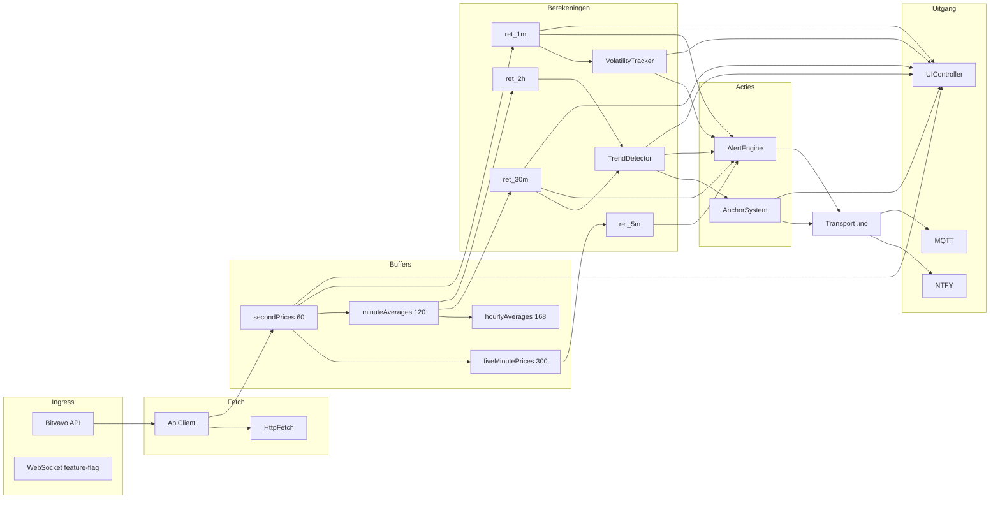
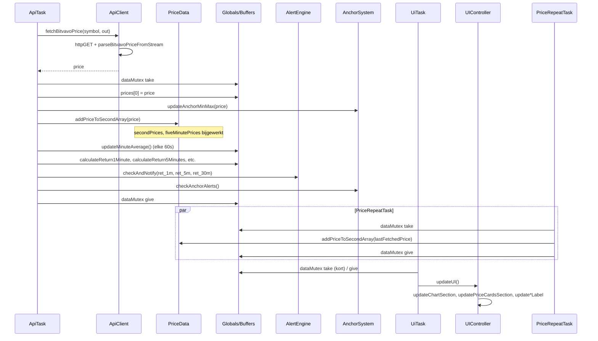

# 02 – Dataflow

## Overzicht: van API tot UI en alerts

Prijsdata loopt van de Bitvavo API via Net/ApiClient naar globale arrays en PriceData; returns en trend/volatiliteit worden berekend; Anchor en AlertEngine beslissen over alerts en bouwen de payload, waarna de transportlaag in .ino (NTFY, en voor anchor ook MQTT) verzendt; UIController leest data voor het scherm. Onderstaande flowchart en sequentiediagrammen vatten dit samen.

---

## Flowchart: hoofdlijnen



---

## Eenheid ret_* (returns)

- **ret_*** wordt in de code berekend als **percentagepunten**: `((priceNow - priceXAgo) / priceXAgo) * 100.0f` (zie o.a. `calculatePercentageReturn()` in .ino). Voorbeeld: 0,12 betekent 0,12% beweging; drempels (bijv. `SPIKE_1M_THRESHOLD_DEFAULT 0.31f`) zijn dus ook in percentagepunten (0,31%).
- Thresholds en vergelijkingen (|ret_1m| >= spike1m, enz.) gebruiken dezelfde eenheid.

---

## Timeframes en buffers

- **Seconden (1m)**: `secondPrices[60]`, `secondIndex`; elke API-call + elke 2s (priceRepeatTask) → `priceData.addPriceToSecondArray(price)`. Return 1m = (nu − 60s) / 60s geleden, in percentagepunten.
- **5 minuten**: `fiveMinutePrices[300]`, `fiveMinuteIndex`; zelfde `addPriceToSecondArray` vult ook 5m-buffer. Return 5m = (nu − 300s) / 300s geleden, in percentagepunten.
- **30 min / 2 uur**: Elk volle minuut wordt het gemiddelde van de 60 seconden in `minuteAverages[120]` gezet (`updateMinuteAverage()` in .ino). Return 30m/2h over die buffers, in percentagepunten.
- **Uur / 7d**: `hourlyAverages[168]` wordt periodiek gevuld; gebruikt voor ret_7d.

Warm-start vult bij opstart (als ingeschakeld) 1m/5m/30m/2h-buffers met Bitvavo candles, zodat ret_2h/ret_30m snel beschikbaar zijn.

**PriceRepeatTask – waarschuwing:** Bij tijdelijke API-uitval of trage responses blijft priceRepeatTask de *laatste* opgehaalde prijs elke 2s in de ringbuffer zetten. Daardoor kunnen 1m/5m-returns kunstmatig afgevlakt worden (minder volatiliteit) tot er weer nieuwe API-prijzen binnenkomen. Bij het interpreteren van alerts in rustige periodes na een netwerkstoring: korte tijd na herstel kunnen returns nog “achterlopen”.

---

## Sequentie: API → buffers → returns → alerts



---

## UI thread-safety en snapshot-patroon

- **Huidige gedrag (uiTask):** De code neemt `dataMutex` zeer kort (of met timeout 0), geeft hem direct weer en roept daarna `updateUI()` aan. Alle leesacties van globals (prices, ret_*, trend, volatiliteit, anchor, enz.) gebeuren **zonder** mutex. Zie .ino rond regel 8802: “We checken alleen kort of er geen writer actief is, en updaten daarna zonder lock.”
- **Risico:** Tijdens `updateUI()` kunnen apiTask of priceRepeatTask dezelfde globals wijzigen; de UI kan daardoor een inconsistent plaatje tonen (bijv. prijs van kaart en return van een andere tick) of kortstondig “oude” waarden. Geen crash, wel mogelijke visuele inconsistentie.
- **Aanbevolen patroon (snapshot under mutex):** Voor volledige thread-safety zou uiTask: (1) mutex nemen, (2) alle voor de UI benodigde velden kopiëren naar een lokale struct (prices[], ret_1m/5m/30m/2h, trend/vol state, anchor, warm-start status, connectivity flags, lastAlert-timestamps indien getoond), (3) mutex geven, (4) alleen op basis van die snapshot de UI updaten. De huidige code implementeert dit patroon **niet**; ze leest globals direct tijdens updateUI().
- **Wat wél veilig is:** LVGL-aanroepen vanuit één task (uiTask); geen UI-updates vanuit apiTask/webTask. Alleen de *consistentie* van de gelezen data over één frame is niet gegarandeerd.

---

## Sequentie: alert cooldown en debounce

Alerts worden gedebounced/beperkt via:

1. **Per-type cooldown**: `lastNotification1Min`, `lastNotification30Min`, `lastNotification5Min`; pas opnieuw notificatie als `(now - lastNotification*) >= cooldown*Ms`.
2. **Max per uur**: `alerts1MinThisHour`, …; elk uur gereset; max o.a. MAX_1M_ALERTS_PER_HOUR (3).
3. **2h-alerts**: throttling-matrix (tijd sinds laatste 2h-alerttype), global secondary cooldown, coalescing-window.

```mermaid
sequenceDiagram
    participant ApiTask
    participant AlertEngine
    participant checkAndNotify
    participant checkAlertConditions
    participant sendNotification

    ApiTask->>AlertEngine: checkAndNotify(ret_1m, ret_5m, ret_30m)
    AlertEngine->>AlertEngine: cacheAbsoluteValues(...)
    AlertEngine->>AlertEngine: evaluateVolumeRange (1m/5m)

    alt 1m spike
        AlertEngine->>checkAlertConditions: (now, lastNotification1Min, cooldown1MinMs, alerts1MinThisHour, MAX_1M_ALERTS_PER_HOUR)
        checkAlertConditions-->>AlertEngine: true/false
        alt conditions OK
            AlertEngine->>sendNotification: title, msg, colorTag (payload)
            Note over sendNotification: In .ino: sendNotification() → sendNtfyNotification() (transport)
            AlertEngine->>AlertEngine: lastNotification1Min = now; alerts1MinThisHour++
        end
    end

    alt 5m move
        AlertEngine->>checkAlertConditions: (now, lastNotification5Min, cooldown5MinMs, ...)
        alt conditions OK
            AlertEngine->>sendNotification: ...
            AlertEngine->>AlertEngine: lastNotification5Min = now; alerts5MinThisHour++
        end
    end

    alt 30m move
        AlertEngine->>checkAlertConditions: (now, lastNotification30Min, cooldown30MinMs, ...)
        alt conditions OK
            AlertEngine->>sendNotification: ...
            AlertEngine->>AlertEngine: lastNotification30Min = now; alerts30MinThisHour++
        end
    end

    Note over AlertEngine: Elk uur: hourStartTime bijwerken, alerts*ThisHour resetten
```

---

## Mutex-gebruik

- **dataMutex**: Beschermt gedeelde prijs-/buffer-/return-state. Genomen door: apiTask (fetch + buffer-updates + returns + alert/anchor-checks), priceRepeatTask (addPriceToSecondArray). uiTask: neemt kort (timeout 0) om te checken of er geen writer actief is, geeft direct weer, roept dan `updateUI()` aan **zonder** mutex — alle leesacties van globals gebeuren dus buiten de mutex (zie sectie “UI thread-safety en snapshot-patroon” hierboven).
- **gNetMutex**: Serialiseert HTTP/API-aanroepen (ApiClient, HttpFetch, NTFY) zodat WiFiClient/HTTPClient niet gelijktijdig wordt gebruikt.

---

## WebSocket (WS)

- **Primaire prijsdata:** HTTP polling via ApiClient (Bitvavo price + candles) is de hoofddata-ingang. WS is feature-flagged (`WS_ENABLED` in platform_config.h, default 1) en wordt stap-voor-stap gemigreerd (maybeInitWebSocketAfterWarmStart, processWsTextMessage in .ino). Als WS actief is, kan aanvullende/real-time data worden verwerkt; de exacte rol (alleen candles, of ook ticker) staat in .ino (processWsTextMessage, wsClient loop).
- Voor volledige zekerheid over “alleen HTTP” vs “HTTP + WS actief”: zie .ino en platform_config.h; documentatie houdt hier “HTTP primary, WS optional/feature-flagged” aan.

---
**[← 01 Architectuur](01_ARCHITECTURE.md)** | [Overzicht technische docs](../README_NL.md#technische-documentatie-code-werking) | **[03 Alertregels →](03_ALERTING_RULES.md)**
