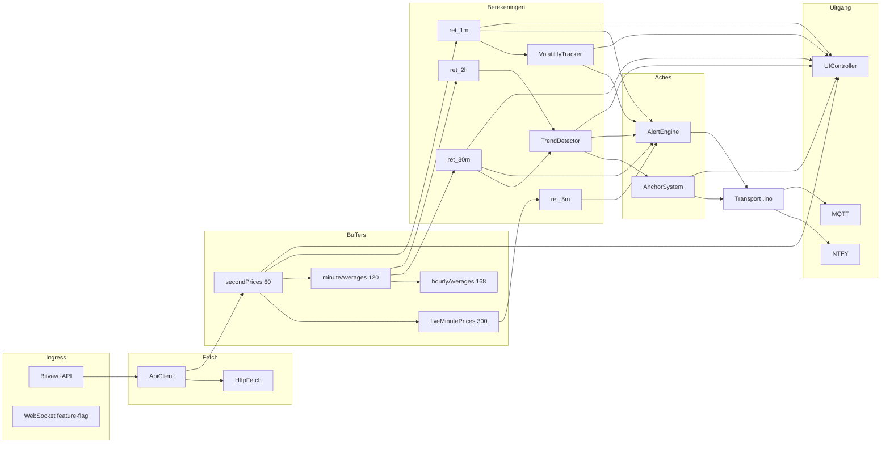
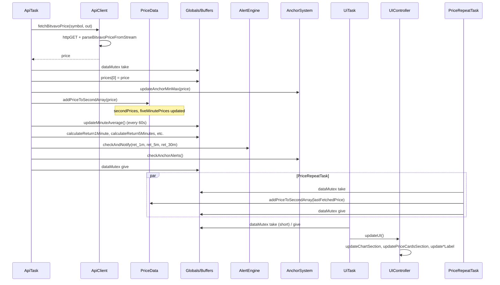

# 02 – Dataflow

## Overview: from API to UI and alerts

Price data flows from the Bitvavo API via Net/ApiClient to global arrays and PriceData; returns and trend/volatility are computed; Anchor and AlertEngine decide on alerts and build the payload, after which the transport layer in .ino (NTFY, and for anchor also MQTT) sends; UIController reads data for the screen. The flowchart and sequence diagrams below summarise this.

---

## Flowchart: main flow



---

## ret_* unit (returns)

- **ret_*** is computed in code as **percentage points**: `((priceNow - priceXAgo) / priceXAgo) * 100.0f` (see e.g. `calculatePercentageReturn()` in .ino). Example: 0.12 means 0.12% move; thresholds (e.g. `SPIKE_1M_THRESHOLD_DEFAULT 0.31f`) are also in percentage points (0.31%).
- Thresholds and comparisons (|ret_1m| >= spike1m, etc.) use the same unit.

---

## Timeframes and buffers

- **Seconds (1m)**: `secondPrices[60]`, `secondIndex`; each API call + every 2s (priceRepeatTask) → `priceData.addPriceToSecondArray(price)`. Return 1m = (now − 60s ago) / 60s ago, in percentage points.
- **5 minutes**: `fiveMinutePrices[300]`, `fiveMinuteIndex`; same `addPriceToSecondArray` also fills 5m buffer. Return 5m = (now − 300s ago) / 300s ago, in percentage points.
- **30 min / 2 hour**: Each full minute the average of the 60 seconds is written to `minuteAverages[120]` (`updateMinuteAverage()` in .ino). Return 30m/2h over those buffers, in percentage points.
- **Hour / 7d**: `hourlyAverages[168]` is filled periodically; used for ret_7d.

Warm-start fills 1m/5m/30m/2h buffers with Bitvavo candles on boot (when enabled), so ret_2h/ret_30m are available quickly.

**PriceRepeatTask – warning:** During temporary API failure or slow responses, priceRepeatTask keeps putting the *last* fetched price into the ring buffer every 2s. So 1m/5m returns can be artificially flattened (less volatility) until new API prices arrive. When interpreting alerts in quiet periods after a network outage: shortly after recovery returns can still "lag".

---

## Sequence: API → buffers → returns → alerts



---

## UI thread-safety and snapshot pattern

- **Current behaviour (uiTask):** The code takes `dataMutex` very briefly (or with timeout 0), releases it immediately and then calls `updateUI()`. All reads of globals (prices, ret_*, trend, volatility, anchor, etc.) happen **without** the mutex. See .ino around line 8802: "We only check briefly that no writer is active, then update without lock."
- **Risk:** During `updateUI()`, apiTask or priceRepeatTask can modify the same globals; the UI can show an inconsistent picture (e.g. price from one tick and return from another) or briefly "stale" values. No crash, but possible visual inconsistency.
- **Recommended pattern (snapshot under mutex):** For full thread-safety uiTask would: (1) take mutex, (2) copy all fields needed for the UI to a local struct (prices[], ret_1m/5m/30m/2h, trend/vol state, anchor, warm-start status, connectivity flags, lastAlert timestamps if shown), (3) release mutex, (4) update the UI only from that snapshot. The current code does **not** implement this; it reads globals directly during updateUI().
- **What is safe:** LVGL calls from a single task (uiTask); no UI updates from apiTask/webTask. Only the *consistency* of the read data over one frame is not guaranteed.

---

## Sequence: alert cooldown and debounce

Alerts are debounced/limited by:

1. **Per-type cooldown**: `lastNotification1Min`, `lastNotification30Min`, `lastNotification5Min`; next notification only when `(now - lastNotification*) >= cooldown*Ms`.
2. **Max per hour**: `alerts1MinThisHour`, …; reset each hour; max e.g. MAX_1M_ALERTS_PER_HOUR (3).
3. **2h alerts**: throttling matrix (time since last 2h alert type), global secondary cooldown, coalescing window.

```mermaid
sequenceDiagram
    participant ApiTask
    participant AlertEngine
    participant checkAndNotify
    participant checkAlertConditions
    participant sendNotification

    ApiTask->>AlertEngine: checkAndNotify(ret_1m, ret_5m, ret_30m)
    AlertEngine->>AlertEngine: cacheAbsoluteValues(...)
    AlertEngine->>AlertEngine: evaluateVolumeRange (1m/5m)

    alt 1m spike
        AlertEngine->>checkAlertConditions: (now, lastNotification1Min, cooldown1MinMs, alerts1MinThisHour, MAX_1M_ALERTS_PER_HOUR)
        checkAlertConditions-->>AlertEngine: true/false
        alt conditions OK
            AlertEngine->>sendNotification: title, msg, colorTag (payload)
            Note over sendNotification: In .ino: sendNotification() → sendNtfyNotification() (transport)
            AlertEngine->>AlertEngine: lastNotification1Min = now; alerts1MinThisHour++
        end
    end

    alt 5m move
        AlertEngine->>checkAlertConditions: (now, lastNotification5Min, cooldown5MinMs, ...)
        alt conditions OK
            AlertEngine->>sendNotification: ...
            AlertEngine->>AlertEngine: lastNotification5Min = now; alerts5MinThisHour++
        end
    end

    alt 30m move
        AlertEngine->>checkAlertConditions: (now, lastNotification30Min, cooldown30MinMs, ...)
        alt conditions OK
            AlertEngine->>sendNotification: ...
            AlertEngine->>AlertEngine: lastNotification30Min = now; alerts30MinThisHour++
        end
    end

    Note over AlertEngine: Each hour: update hourStartTime, reset alerts*ThisHour
```

---

## Mutex usage

- **dataMutex**: Protects shared price/buffer/return state. Taken by: apiTask (fetch + buffer updates + returns + alert/anchor checks), priceRepeatTask (addPriceToSecondArray). uiTask: takes briefly (timeout 0) to check no writer is active, releases immediately, then calls `updateUI()` **without** mutex — all reads of globals happen outside the mutex (see "UI thread-safety and snapshot pattern" above).
- **gNetMutex**: Serialises HTTP/API calls (ApiClient, HttpFetch, NTFY) so WiFiClient/HTTPClient are not used concurrently.

---

## WebSocket (WS)

- **Primary price data:** HTTP polling via ApiClient (Bitvavo price + candles) is the main data path. WS is feature-flagged (`WS_ENABLED` in platform_config.h, default 1) and is being migrated step by step (maybeInitWebSocketAfterWarmStart, processWsTextMessage in .ino). When WS is active, additional/real-time data can be processed; the exact role (candles only, or also ticker) is in .ino (processWsTextMessage, wsClient loop).
- For full certainty on "HTTP only" vs "HTTP + WS active": see .ino and platform_config.h; this doc keeps "HTTP primary, WS optional/feature-flagged".

---
**[← 01 Architecture](01_ARCHITECTURE_EN.md)** | [Technical docs overview](../README.md#technical-documentation-code--architecture) | **[03 Alerting rules →](03_ALERTING_RULES_EN.md)**
