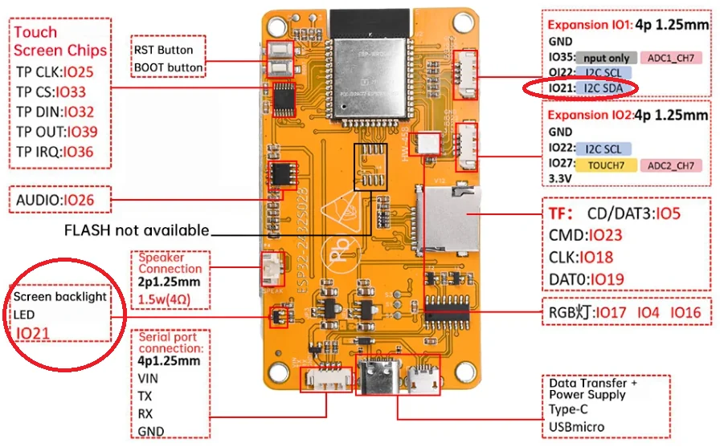
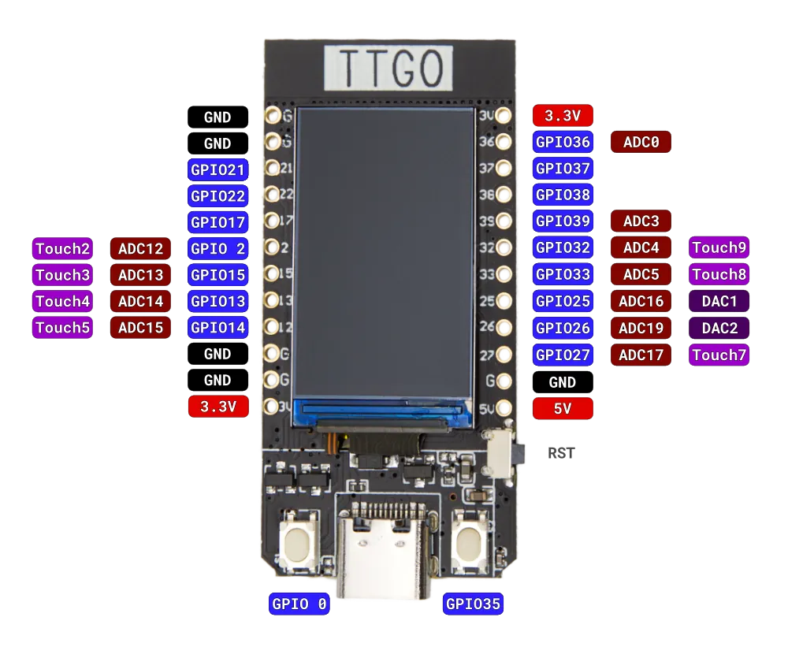
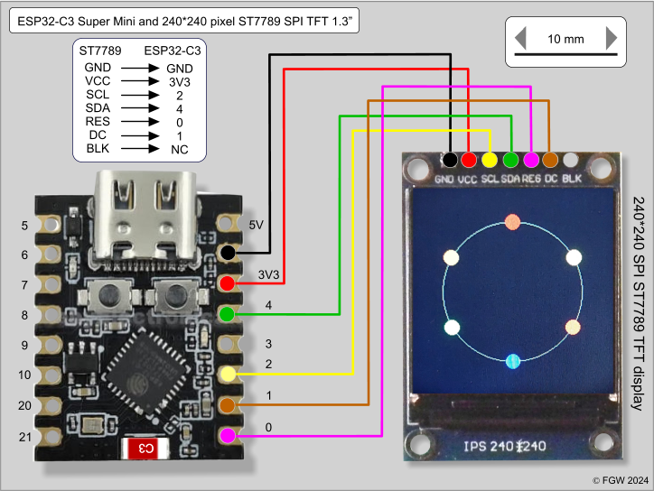

# Chapter 3: Hardware Requirements

## 3.1 Introduction
The ESP32-Crypto-Alert project is designed to run on various ESP32 development boards, preferably those with a built-in TFT display. This makes the device fully standalone and visually appealing without requiring additional components.

The project supports both **ready-to-use boards with display** and **custom builds** using a separate ESP32 and TFT screen. The code includes specific configurations for popular boards (via defines at the top of the sketch).

**Minimum requirements:**
- ESP32 module (dual-core, WiFi/BLE)
- At least 4 MB Flash (for OTA updates and web interface)
- Stable 5V power supply (via USB or adapter)
- WiFi connection for Binance data and notifications

A display is strongly recommended but not mandatory (headless operation with only notifications is possible).

## 3.2 Recommended Ready-to-Use Boards

### 3.2.1 ESP32-2432S028R "Cheap Yellow Display" (CYD)
The most commonly used and cheapest option (€10-15). Features a 2.8" resistive touchscreen (ILI9341), SD card slot, and plenty of GPIO pins.

  
*Front view of the ESP32-2432S028R "Cheap Yellow Display".*

  
*Back view with pin labels.*

### 3.2.2 LilyGO TTGO T-Display
Compact board with a 1.14" IPS display (ST7789). Ideal for a small desk setup.

  
*LilyGO TTGO T-Display.*

### 3.2.3 Waveshare ESP32-S3-GEEK
Compact board with ESP32-S3, 1.14" IPS LCD (ST7789, 240×135), 16MB Flash, 2MB PSRAM, and TF card slot.

  
*Waveshare ESP32-S3-GEEK – excellent performance and many interfaces.*

## 3.3 Custom Builds
When using a generic ESP32 (e.g., DevKit), you can connect a separate TFT display via SPI.

  
*Pinout of an ESP32-S3 Supermini board.*

  
*Typical SPI wiring for an ILI9341 or ST7789 TFT display.*

## 3.4 Power Supply and Accessories
- **Power**: USB cable (min. 1A). For permanent use, a 5V/2A adapter is recommended.
- **Enclosure**: Many 3D-printable cases available on Thingiverse/Printables.
- **Optional**: MicroSD card (for logging), external antenna for better WiFi.

## 3.5 Compatibility Overview

| Board/Model                  | Display Type          | Resolution   | Touch         | Directly Supported | Notes                                |
|------------------------------|-----------------------|--------------|---------------|---------------------|--------------------------------------|
| ESP32-2432S028R (CYD)        | 2.8" ILI9341         | 320×240     | Resistive    | Yes                | Best price/quality                   |
| LilyGO TTGO T-Display        | 1.14" ST7789         | 240×135     | No           | Yes                | Compact                              |
| Waveshare ESP32-S3-GEEK      | 1.14" IPS ST7789     | 240×135     | No           | Yes (well compatible)| Powerful, TF slot                    |
| Generic ESP32 + TFT          | Variable             | Variable    | Optional     | Yes (custom config)| Flexible, more work                  |

---

*Go to [Chapter 2: Features and Capabilities](02-Features-and-Capabilities.md) | [Chapter 4: Installation](04-Installation.md)*